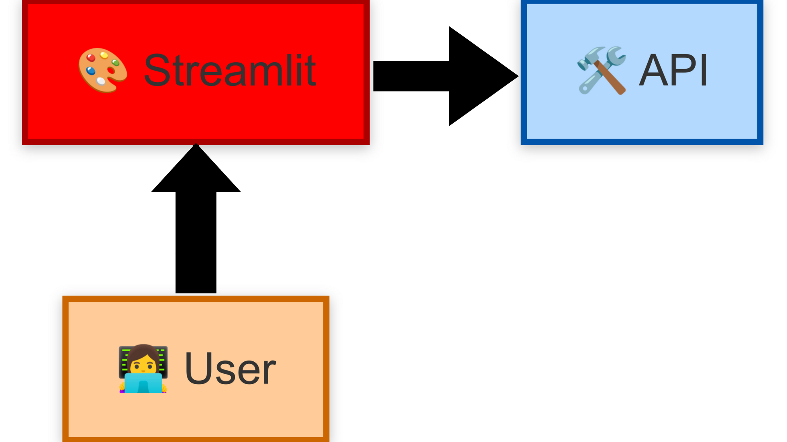

# **Phase 2 : Data Analyst - Exploration et Visualisation**  

**Objectif : Explorer et analyser les données en interrogeant l’API.**  

🔹 **Analyse Exploratoire des Données (EDA)** :  
- Utiliser le **SDK Python** pour requêter l’API et récupérer les données.  
- Identifier les tendances dans les notes des films.  
- Étudier les genres les plus populaires et les préférences des utilisateurs.  

🔹 **Construction d’une Data App avec Streamlit** :  
- Créer une **application interactive** qui permet de visualiser les tendances du cinéma.  
- Intégrer des **tableaux dynamiques** et des **graphiques interactifs**.  
- Offrir une **recherche avancée** des films en fonction des notes et des genres.  

**LIen vers l'applicatrion :** https://analyse-films-anee-marcel.streamlit.app/

---